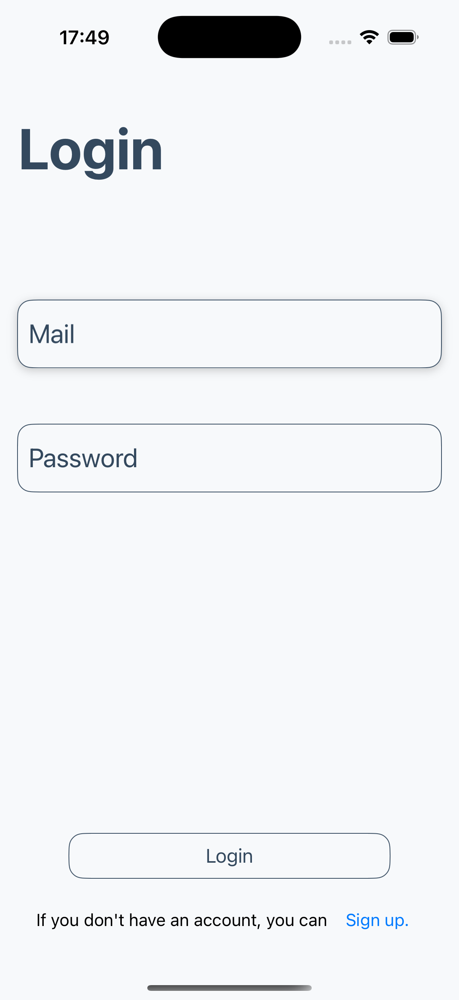
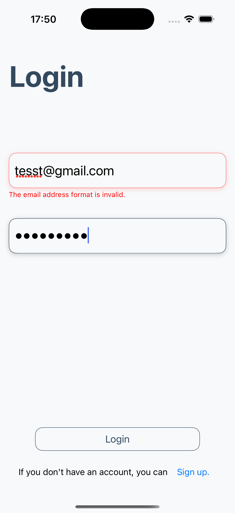
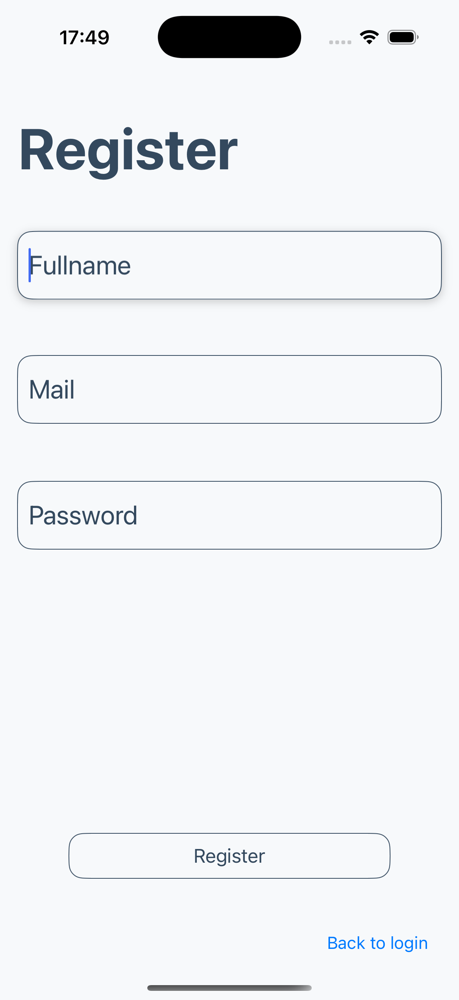
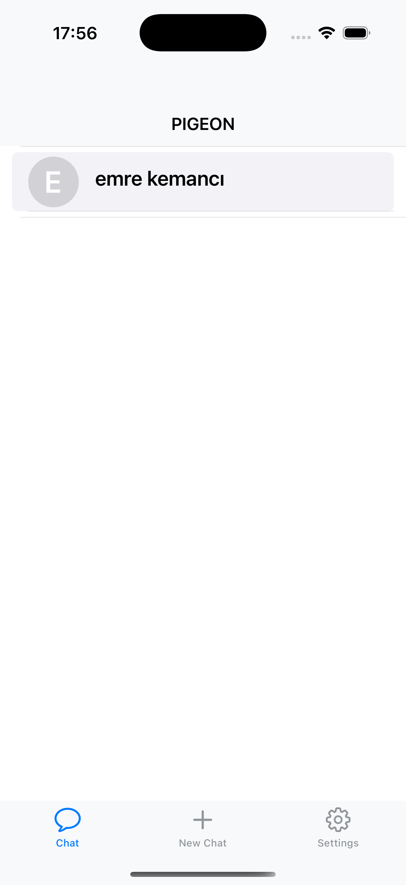
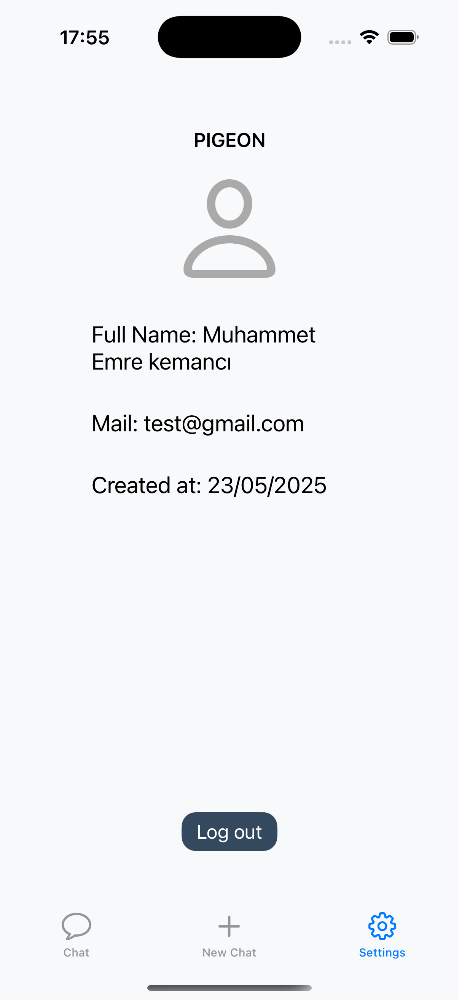
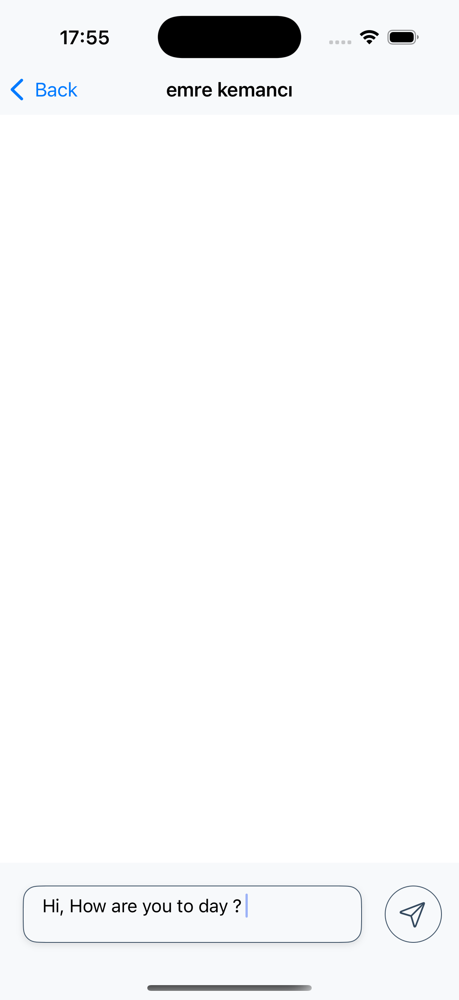
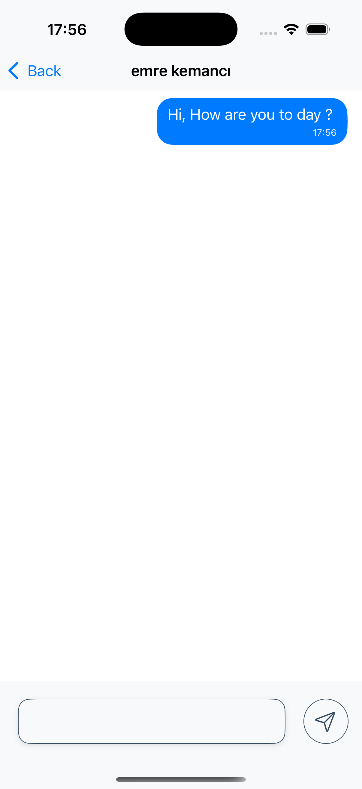

#  Pigeon – Real-Time Messaging App

Pigeon is a modern iOS application that enables users to message each other in real time. Built with Firebase, it follows a clean architecture and adheres to MVVM principles.

---

##  Architecture

The app is built using **Clean Architecture** and is organized into the following layers:

- **Domain** – Entities, Use Cases
- **Data** – Repository implementations, Firebase services
- **Presentation** – ViewModels and ViewControllers
- **Coordinator** – Manages navigation between screens
- **Core** – Fixed and usable objects from anywhere

It also follows the **MVVM** (Model-View-ViewModel) design pattern to separate business logic from the UI layer.

---

##  Firebase Services Used

This app is integrated with several Firebase services:

- **Firestore** – Manages chat data
- **Realtime Database** – Enables live data tracking
- **Firebase Auth** – Handles login and registration
- **Firebase Analytics** – Tracks user interactions

---

##  Screenshots











---

##  Setup

To run the project locally, follow these steps:

```bash
git clone https://github.com/yourusername/pigeon.git
cd pigeon
open Pigeon.xcodeproj
```

### Required Configuration:

- Make sure Xcode 14+ is installed.
- Add your `GoogleService-Info.plist` file to the project root.
- Set your own **Realtime Database URL** in the `FirebaseService` configuration.

---

##  License

This project is licensed under the MIT License. See the `LICENSE` file for details.

---

##  Acknowledgements

- Firebase Team  
- Apple Developer Community  
- Stack Overflow
